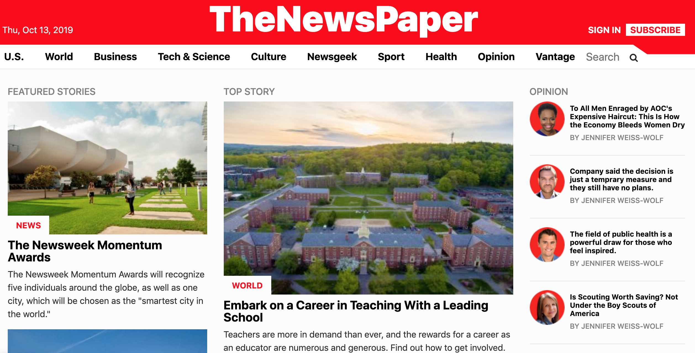
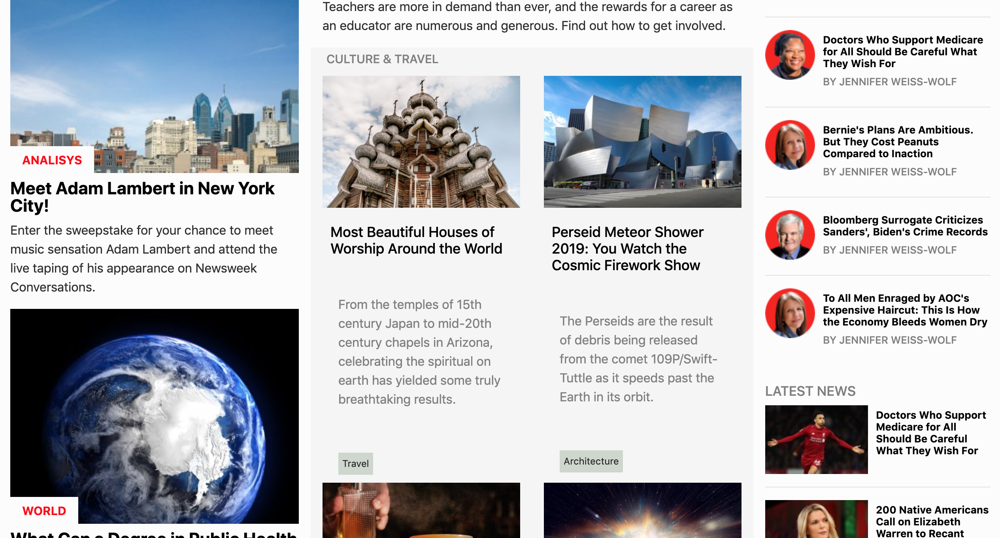
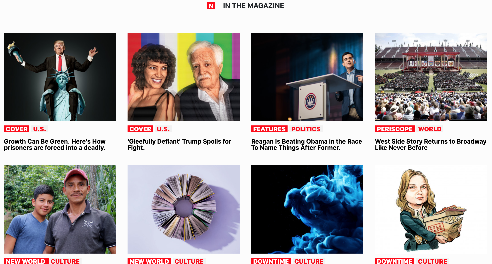
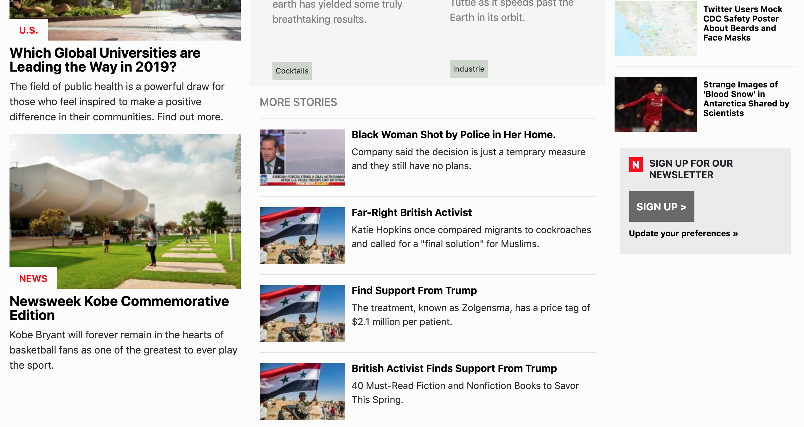
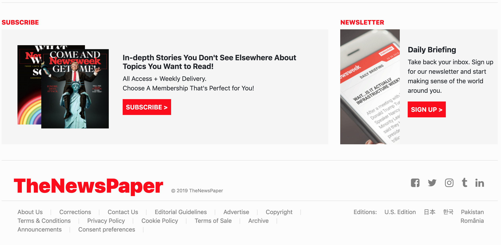

# Mockup NewsPaper Prototype

This project consists of building a prototype from scratch with HTML, CSS(360°) web page that matches whit the news paper web industry.

## Main Page whit Navbar

 
 

## Articles section

 
 

## Magazine section

 
 

## News section

 
 

## Footer

 
 

Additional description about the project and its features.

# Technologies used
- CSS3
- HTML5
- [Font Awesome Icons](https://fontawesome.com/start)
- [Stickler](https://stickler-ci.com)
- [Githack](https://raw.githack.com/)

## Live Demo

[The App]()

## 🤝 Contributing

Contributions, issues and feature requests are welcome!

## Show your support

Give a ⭐️ if you like this project!

## Acknowledgments

- Hat tip to anyone whose code was used.

## 📝 License

This project is [MIT](https://opensource.org/licenses/MIT) licensed.
